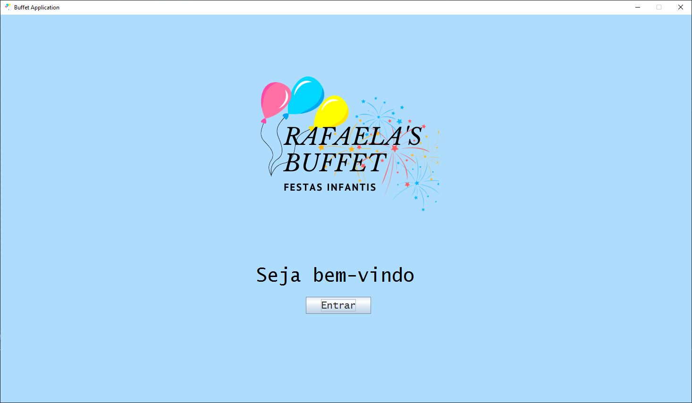
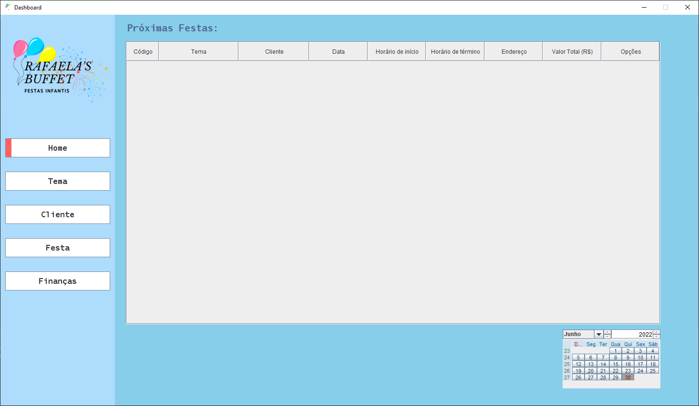
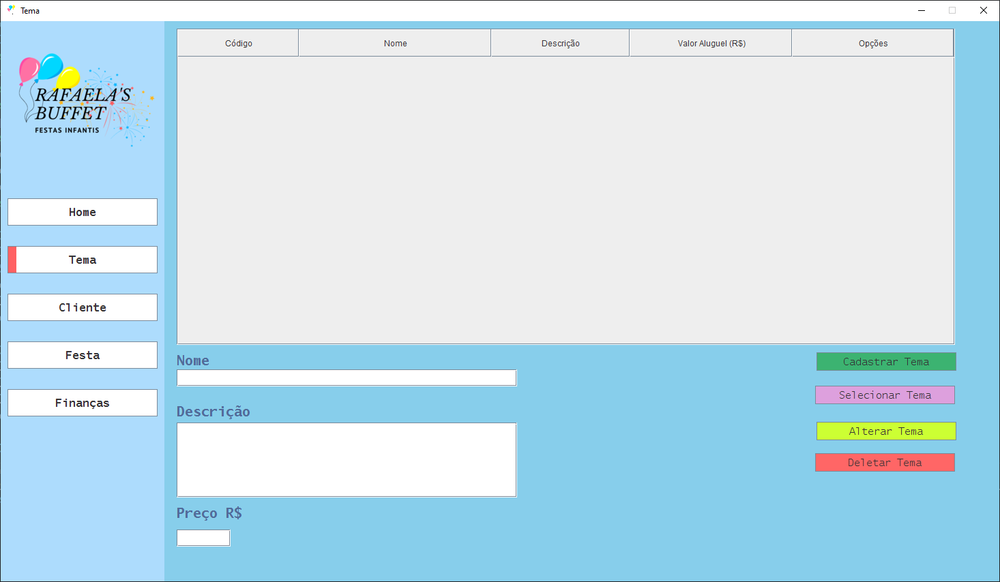
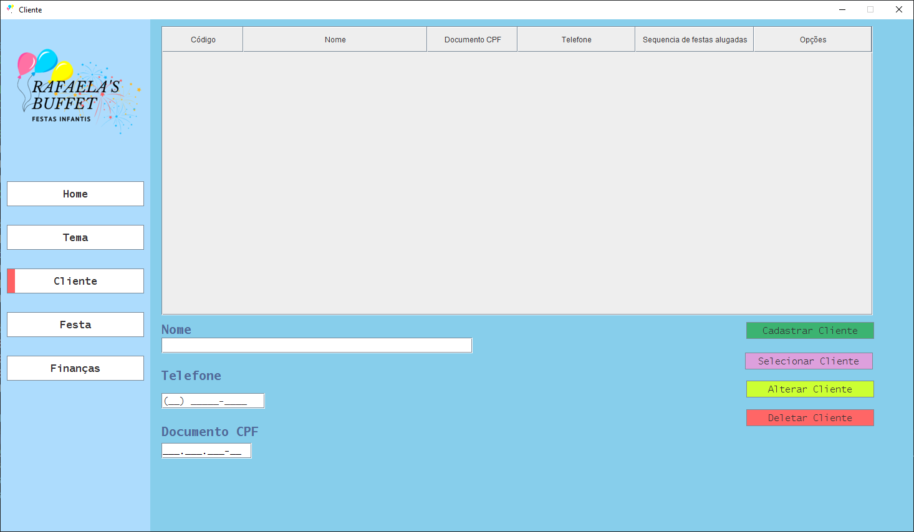
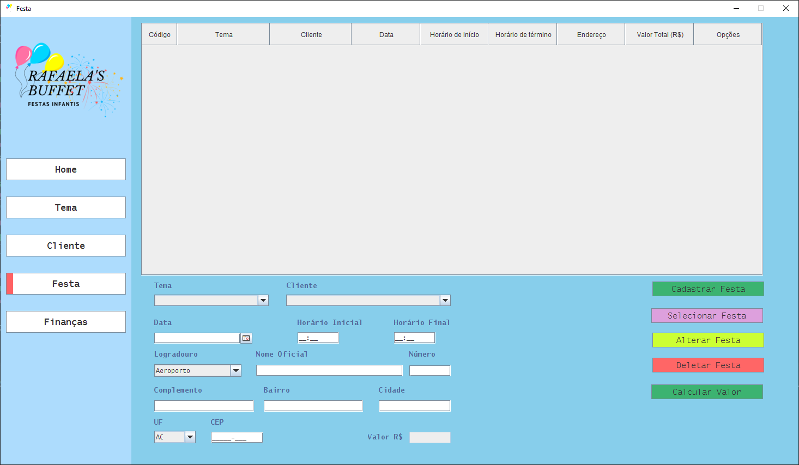
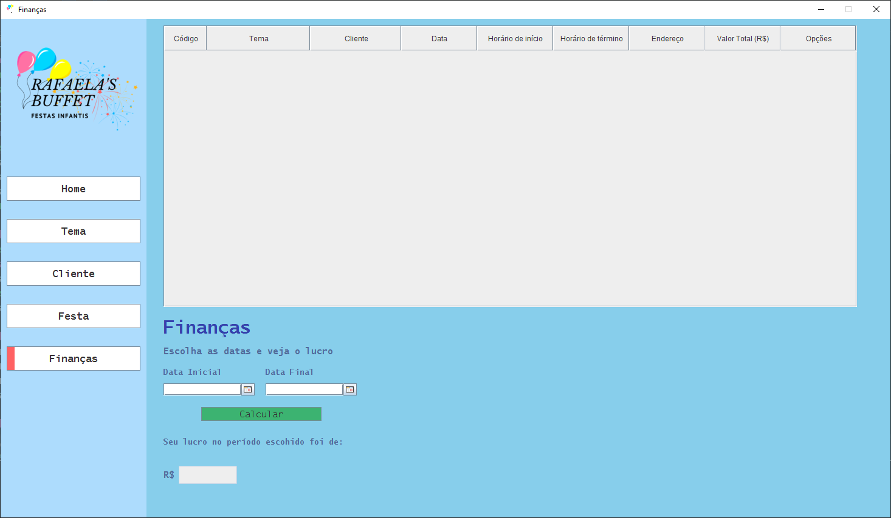

<h3 align="center">
  
</h3>

 <a href="#-sobre-o-projeto">Sobre</a> •
 <a href="#-funcionalidades">Funcionalidades</a> •
 <a href="#-layout">Layout</a> •
 <a href="#-tecnologias-e-ferramentas">Tecnologias e Ferramentas</a> •
 <a href="#-como-executar">Como Executar</a> •
 <a href="#-contribuidores">Contribuidores</a>

## 💻 Sobre o projeto

🎨 Buffet de festas infantis da Rafaela - é um sistema para gerenciamento de buffet.

Projeto foi desenvolvido durante as disciplinas de **Engenharia de Software II & Estruturas de Dados** lecionadas por Cristina Corrêa De Oliveira e Fábio Pereira da Silva.

#### Problemática

Rafaela possui vários temas de festas infantis para aluguel. Ela precisa controlar os aluguéis e para isso quer uma aplicação que permita cadastrar: o nome e o telefone do cliente, o endereço completo da festa, o tema escolhido, a data da festa, a hora de início e término da festa. Além disso, para alguns clientes antigos, Rafaela oferece descontos. Sendo assim, é preciso saber o valor realmente cobrado num determinado aluguel.

---

## ⚙️ Funcionalidades

- [x] Gerenciamento de Clientes;
- [x] Gerenciamento de Temas;
- [x] Gerenciamento de Festas;
- [x] Gerenciamento de Funcionários;
- [x] Receita de um período.

---

## 🎨 Layout

  
  
  
  
  
  

---

## 🛠 Tecnologias e Ferramentas

Esse projeto foi desenvolvido com as seguintes tecnologias e ferramentas:

- Eclipse
- Java
- CSV
- JCalendar
- Swing
- Git

---

## 🧰 Como Executar

Para executar o projeto, é necessário utilizar o Eclipse, para que o mesmo identifique as dependências necessárias para a execução. Uma vez importado o projeto, será criado um arquivo *.classpath* que irá informar qual a classe principal para a execução. Nesse projeto, estamos utilizando o jcalendar para poder trabalhar com calendários, porém, caso aconteça um erro ao rodar a aplicação pela primeira vez, será necessário adicionar 4 libraries no *.classpath*. 
Para fazer isso é só seguir esses passos:
1. Clicar com o botão direito do mouse no projeto 

2. Clicar em Build Path e Configure Build Path 

3. Clicar em Libraries 

4. Clicar em Classpath e add external jars 

5. Localizar as 4 dependências na pasta /lib/ 

6. Selecionar as libs e clicar em abrir

7. Clicar em apply and close

8. Rodar o projeto novamente

---

## 👨‍💻 Contribuidores

<table>
  <tr>
    <td align="center"><a href="https://github.com/anabalves"> <b>Ana Alves</b></a> <a href="https://github.com/anabalves" title="Perfil Ana">🚀</a></td> 
    <td align="center"><a href="https://github.com/arthurviveiros"> <b>Arthur Viveiros</b></a> <a href="https://github.com/arthurviveiros" title="Perfil Arthur">🚀</a></td>
    <td align="center"><a href="https://github.com/cesarVizentini"> <b>Cesar Vizentini</b></a> <a href="https://github.com/cesarVizentini" title="Perfil Cesar">🚀</a></td>
    <td align="center"><a href="https://github.com/LucasMaiellaro"> <b>Lucas Maiellaro</b></a> <a href="https://github.com/LucasMaiellaro" title="Perfil Lucas">🚀</a></td>
  </tr>
</table>

Esperamos que gostem do nosso projeto :smile: