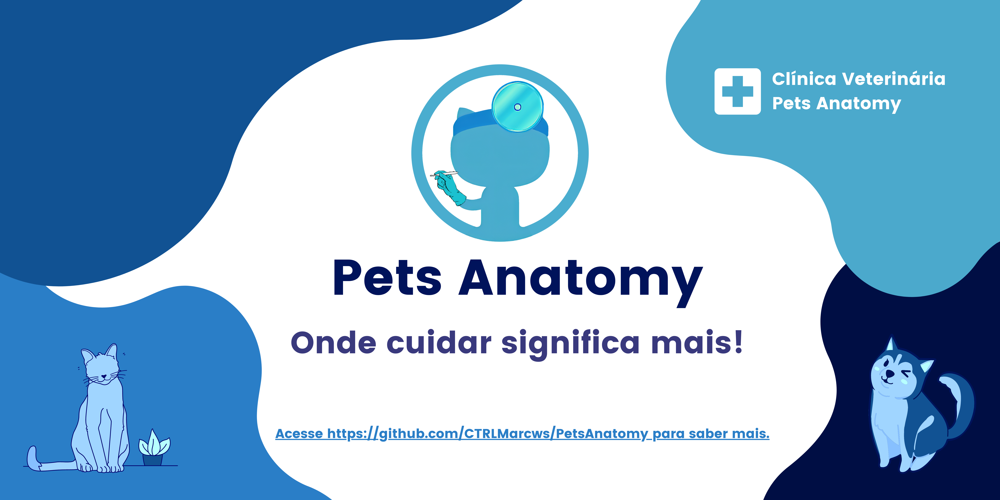
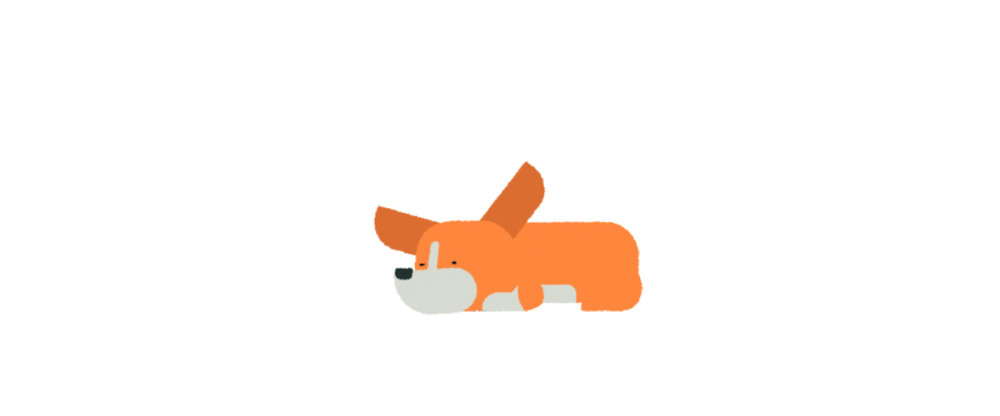
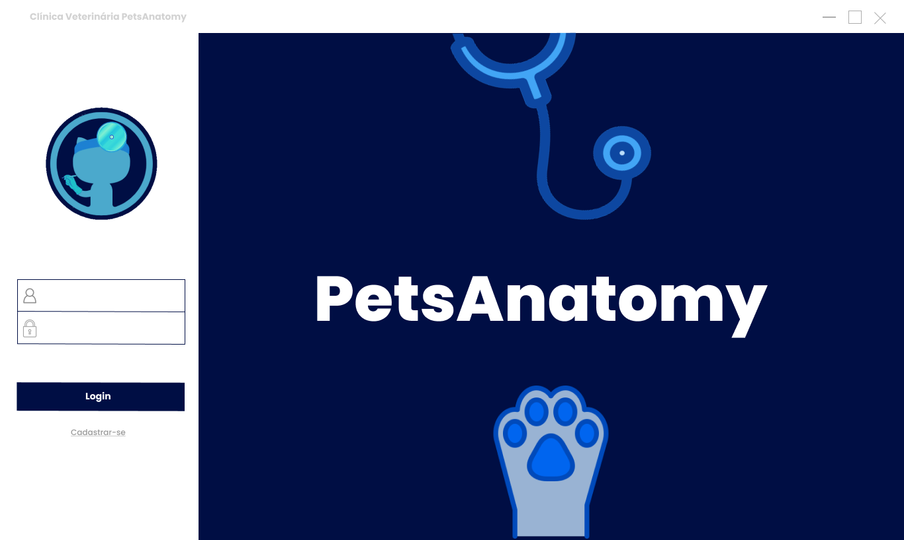
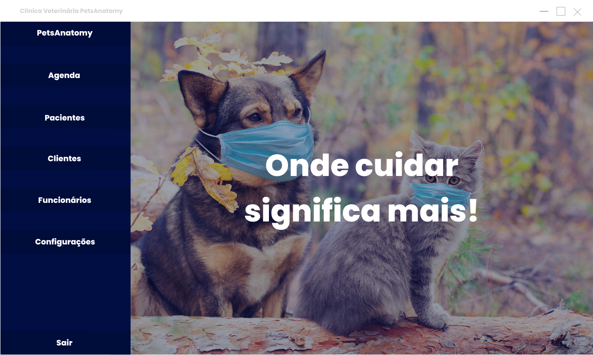
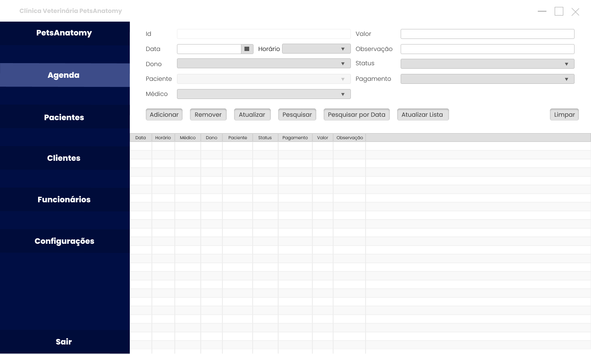
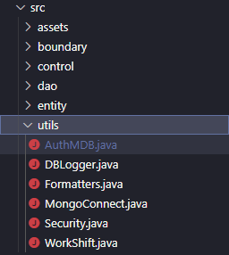

<h1 align="center">
    
</h1>

<h3 align="center"> 
	<b> PetsAnatomy </b>
  
</h3>

<p align="center">
 <a href="#-sobre-o-projeto">Sobre</a> •
 <a href="#-funcionalidades">Funcionalidades</a> •
 <a href="#-layout">Layout</a> • 
 <a href="#-como-executar-o-projeto">Como executar</a> • 
 <a href="#-tecnologias">Tecnologias</a> • 
 <a href="#-contribuidores">Contribuidores</a> • 
 <a href="#user-content--licença">Licença</a>
</p>

## 💻 Sobre o projeto

🐶 PetsAnatomy - é um sistema para gerenciamento de uma Clínica Veterinária.

Projeto foi desenvolvido durante a disciplina de **POO - Programação Orientada a Objetos** lecionada por [Antonio Rodrigues Carvalho Neto](https://github.com/antoniorcn).

---
## ⚙️ Funcionalidades

- [x] Login
- [x] Cadastro
- [x] Crud Agendamentos
- [x] Crud Pacientes
- [x] Crud Donos
- [x] Crud Funcionários

---

## 🎨 Layout

O layout da aplicação está disponível no Figma:

<a href="https://www.figma.com/file/IfZvOoAzbxHZ7cisVcKPlW/Protótipos?node-id=0%3A1">
  
</a>

<p align="center">
  
  
    
</p>

---

## 🚀 Como executar o projeto
### Pré-requisitos

Antes de começar, você vai precisar ter instalado em sua máquina as seguintes ferramentas:
[Git](https://git-scm.com), [Java 1.8](https://www.oracle.com/java/technologies/downloads/#java8-windows). 
Além disto é bom ter um editor para trabalhar com o código como [VSCode](https://code.visualstudio.com/) ou [Eclipse](https://www.eclipse.org/downloads/packages/installer).

```bash

# Clone este repositório
$ git clone git@github.com:CTRLMarcws/PetsAnatomy.git

# Acesse a pasta do projeto no terminal/cmd
$ cd PetsAnatomy

```

Mover o arquivo [AuthMDB.java](./.github/AuthMDB.java) para a pasta utils.



---

## 🛠 Tecnologias

As seguintes ferramentas foram usadas na construção do projeto:

#### **Utilitários**

-   Protótipo:  **[Figma](https://www.figma.com/)**  →  **[Protótipo (PetsAnatomy)](https://www.figma.com/file/IfZvOoAzbxHZ7cisVcKPlW/Protótipos?node-id=0%3A1)**
-   Editor:  **[Visual Studio Code](https://code.visualstudio.com/)**  
-   Markdown:  **[StackEdit](https://stackedit.io/)**,  **[Markdown Emoji](https://github.com/ikatyang/emoji-cheat-sheet)**
-   Ícones:  **[FlatIcon](https://www.flaticon.com/)**
-   Fontes:  **[Poppins](https://fonts.google.com/specimen/Poppins)**
---

## 👨‍💻 Contribuidores
<table>
  <tr>
    <td align="center"><a href="https://github.com/anabalves"><br /><sub><b>Ana Alves</b></sub></a><br /><a href="https://github.com/anabalves" title="Perfil Ana">🚀</a></td> 
    <td align="center"><a href="https://github.com/CTRLMarcws"><br /><sub><b>Marcos Filipe</b></sub></a><br /><a href="https://github.com/CTRLMarcws" title="Perfil Marcos">🚀</a></td>
  </tr>
</table>

---

## 📝 Licença

Este projeto esta sobe a licença [MIT](/20212-programacao-orientada-a-objetos/src/PetsAnatomy/LICENSE).
