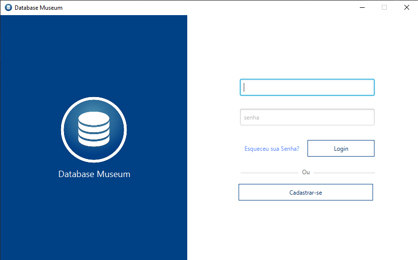
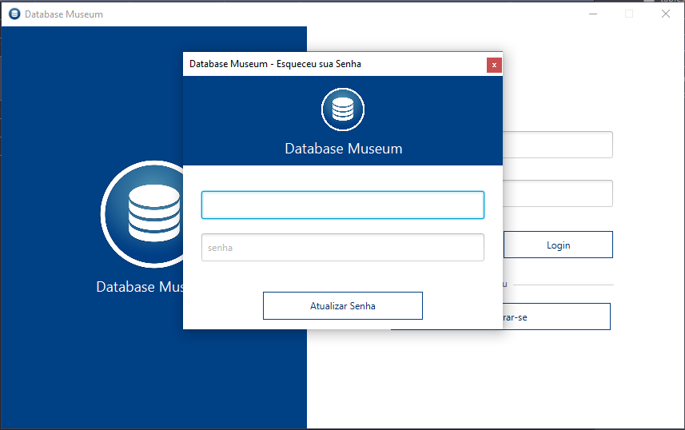
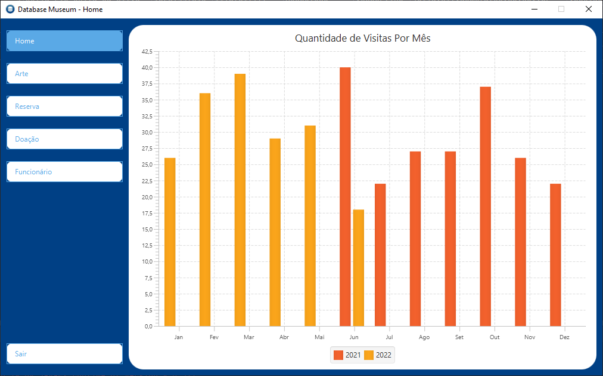
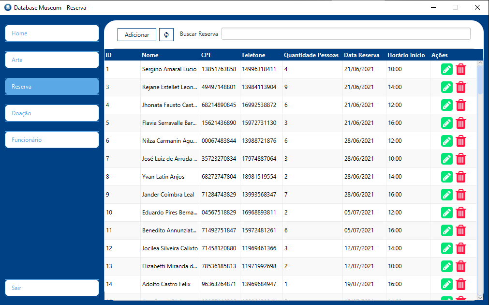
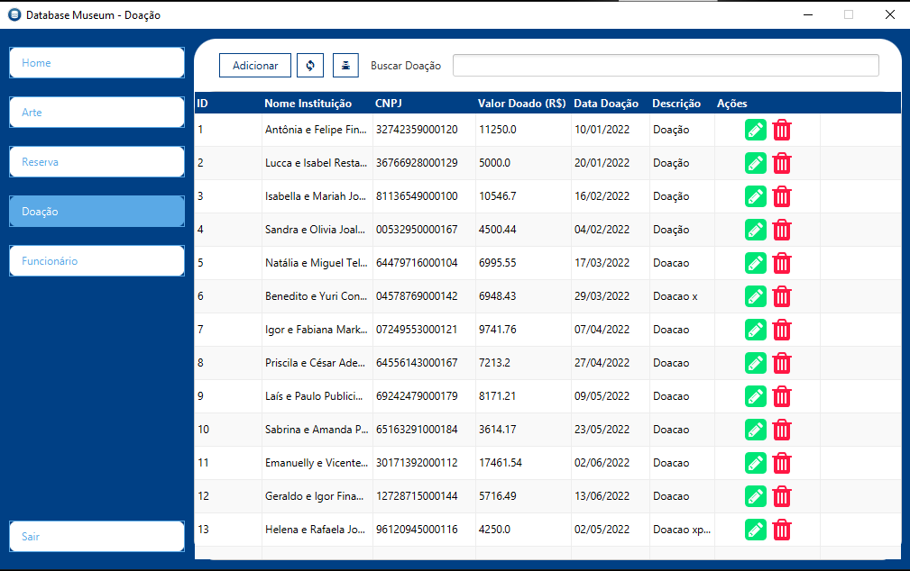
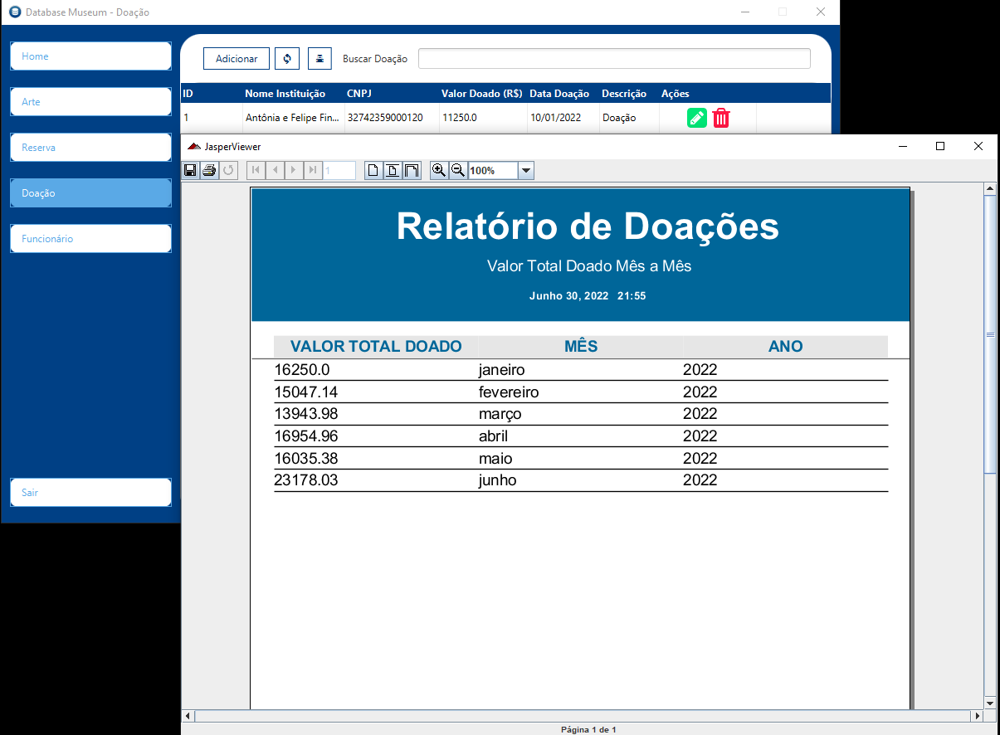
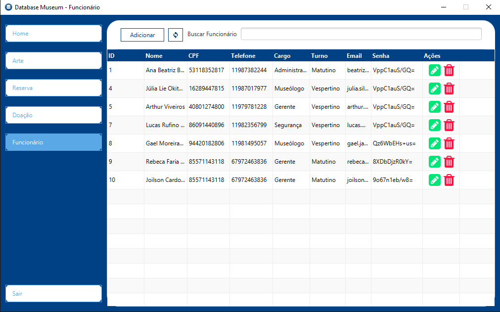

<h3 align="center"> 
  
</h3>

 <a href="#-sobre-o-projeto">Sobre</a> •
 <a href="#-funcionalidades">Funcionalidades</a> •
 <a href="#-layout">Layout</a> • 
 <a href="#-tecnologias-e-ferramentas">Tecnologias e Ferramentas</a> • 
 <a href="#-contribuidores">Contribuidores</a>

## 💻 Sobre o projeto

🎨 Database Museum - é um sistema para gerenciamento de museus.

Projeto foi desenvolvido durante a disciplina de **Laboratório de Banco de Dados** lecionada por Joilson de Souza Cardoso.

---
## ⚙️ Funcionalidades

- [X]  Cadastro e Login de Funcionários;
- [X]  Gerenciamento de Obras de Arte; 
- [X]  Gerenciamento de Doações;
- [X]  Gerenciamento de Reservas;
- [X]  Gerenciamento de Funcionários;
- [X]  Relatório de Valor Total Doado Mês a Mês;
- [X]  Gráfico de Quantidade de Visitas Mês a Mês.

---

## 🎨 Layout

  
  
  
  
  
  
  
  
  

---

## 🛠 Tecnologias e Ferramentas

Esse projeto foi desenvolvido com as seguintes tecnologias e ferramentas:

-   Java
-   MySQL
-   JavaFx
-   JasperReports
-   Intellij
-   Git

---

## 👨‍💻 Contribuidores
<table>
  <tr>
    <td align="center"><a href="https://github.com/anabalves"> <b>Ana Alves</b></a> <a href="https://github.com/anabalves" title="Perfil Ana">🚀</a></td>
  </tr>
</table>

