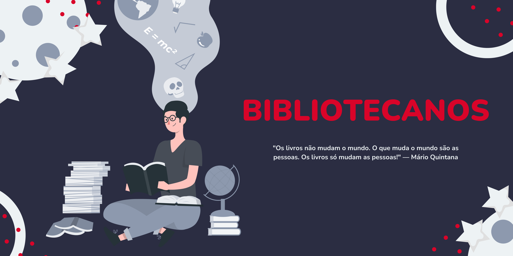
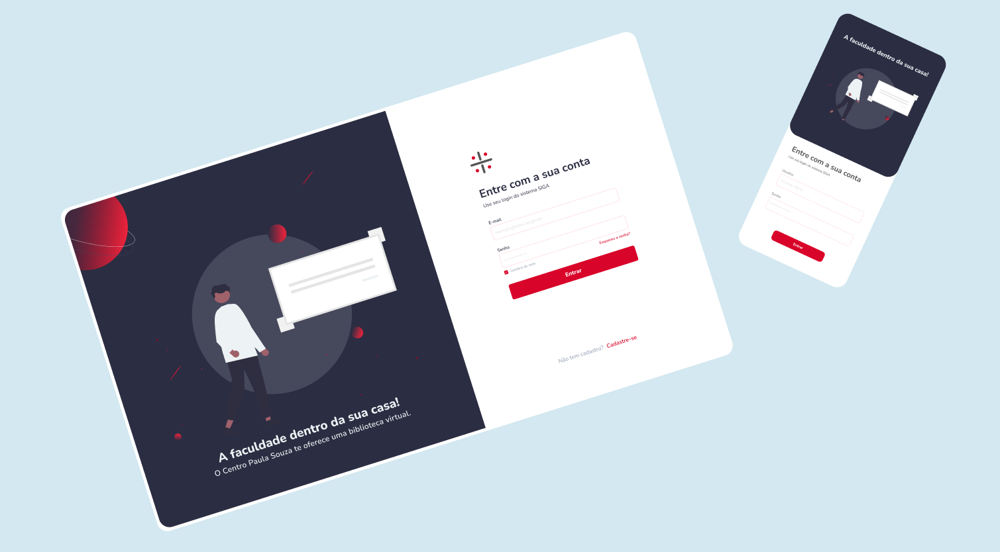

<h1 align="center">
    
</h1>

<h3 align="center"> 
  
</h3>

 <a href="#-sobre-o-projeto">Sobre</a> •
 <a href="#-funcionalidades">Funcionalidades</a> •
 <a href="#-layout">Layout</a> • 
 <a href="#-tecnologias-e-ferramentas">Tecnologias e Ferramentas</a> • 
 <a href="#-contribuidores">Contribuidores</a> • 
 <a href="#user-content--licença">Licença</a>

## 💻 Sobre o projeto

📚 Bibliotecanos - é um sistema para gerenciamento de bibliotecas das FATECS do Centro Paula Souza.

Projeto foi desenvolvido durante a disciplina de **Laboratório de Engenharia de Software** lecionada por Marcus Vasconcelos de Castro.

---
## ⚙️ Funcionalidades

- [X]  Cadastro de usuários;
- [X]  Login de Acesso ao Sistema;
- [X]  Catálogo Online de Livros; 
- [X]  Reserva Online;
- [X]  Envio de e-mail para empréstimos prestes a vencer (Lembrete 2 dias antes ao vencimento);
- [X]  Gerar Relatórios;
- [X]  Efetuar Empréstimos 
- [X]  Efetuar Devoluções;

---

## 🎨 Layout

O layout da aplicação está disponível no Figma:

  

---

## 🛠 Tecnologias e Ferramentas

Esse projeto foi desenvolvido com as seguintes tecnologias e ferramentas:

-   Astah
-   BR Modelo	
-   **[Figma](https://www.figma.com/)**  →  **[Protótipo (Bibliotecanos)](https://www.figma.com/file/gktT4EhSltFHxdbCZtK4LE/Bibliotecando-Prototype)**
-   Java
-   Spring Boot
-   JPA / Hibernate
-   Maven
-   HTML / CSS / JavaScript / TypeScript
-   Angular
-   Apex Charts
-   Heroku
-   Netlify
-   H2 Database
-   PostgreSQL
-   Postman
-   Visual Studio Code
-   Intellij
-   Git

---

## 👨‍💻 Contribuidores
<table>
  <tr>
    <td align="center"><a href="https://github.com/anabalves"> <b>Ana Alves</b></a> <a href="https://github.com/anabalves" title="Perfil Ana">🚀</a></td> 
    <td align="center"><a href="https://github.com/arthurviveiros"> <b>Arthur Viveiros</b></a> <a href="https://github.com/arthurviveiros" title="Perfil Arthur">🚀</a></td>
    <td align="center"><a href="https://github.com/JuliaLieOkita"> <b>Julia Lie Okita</b></a> <a href="https://github.com/JuliaLieOkita" title="Perfil Júlia">🚀</a></td>
    <td align="center"><a href="https://github.com/LucasMaiellaro"> <b>Lucas Maiellaro</b></a> <a href="https://github.com/LucasMaiellaro" title="Perfil Lucas">🚀</a></td>
  </tr>
</table>

---

## 📝 Licença

Este projeto esta sobe a licença [MIT](/20221-laboratorio-de-engenharia-de-software/bibliotecanos/LICENSE).
